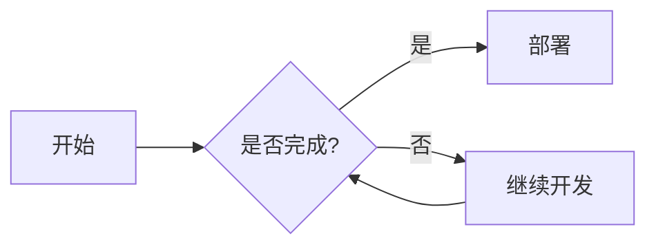
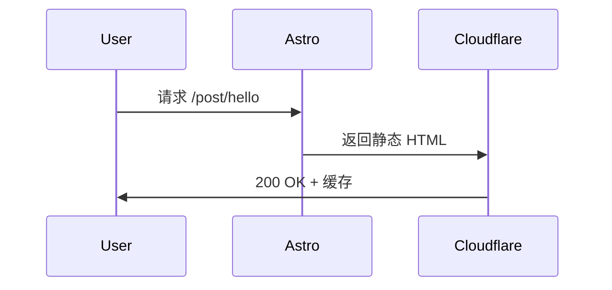

## **🔤 基础语法速查**

### **标题**

```markdown
# 一级标题（页面主标题，每篇限 1 个）
## 二级标题（章节）
### 三级标题（小节）
#### 四级标题（细节）
```

### **文本样式**

```markdown
**加粗** 或 __加粗__      →  **加粗**
*斜体* 或 _斜体_          →  *斜体*
***加粗斜体***           →  ***加粗斜体***
~~删除线~~               →  ~~删除线~~
`行内代码`               →  `行内代码`
> 引用块                →  > 引用块
```

### **列表**

```markdown
<!-- 无序列表 -->
- 项目 1
- 项目 2
  - 子项目（缩进 2 空格）

<!-- 有序列表 -->
1. 第一步
2. 第二步
   1. 子步骤（缩进 3 空格 + 数字）

<!-- 任务列表（Fuwari 支持 ✅） -->
- [ ] 待办事项
- [x] 已完成
```

### **链接与图片**

```markdown
<!-- 链接 -->
[显示文本](https://upsubs.com)
[带标题](https://upsubs.com "点击跳转")

<!-- 图片 -->

  // 部分渲染器支持

<!-- 参考式链接（长文推荐） -->
[官网][1]
[1]: https://upsubs.com "可选标题"
```

### **水平线与换行**

```markdown
---  或  ***  或  ___   →  水平分割线

行尾加 2 个空格 + 回车   →  强制换行（否则合并为一段）
```

---

## **🎨 高级排版技巧**

### **表格**

```markdown
| 左对齐 | 居中对齐 | 右对齐 |
|:-------|:--------:|-------:|
| 左     |   中     |     右 |
| Left   |  Center  |  Right |

<!-- 技巧：用 - 对齐列宽，提升源码可读性 -->
```

### **转义与特殊字符**

```markdown
\* 显示星号本身 → *
\` 显示反引号 → `
\\ 显示反斜杠 → \

<!-- HTML 实体（兼容所有渲染器） -->
&amp; → &   &lt; → <   &gt; → >   &nbsp; → 空格
```

### **脚注（需启用插件）**

```markdown
这是一个观点[^1]，支持详细说明。

[^1]: 脚注内容会显示在文末，适合补充技术细节。
```

### **定义列表（部分渲染器支持）**

```markdown
术语 1
: 定义内容 1

术语 2
: 定义内容 2
```

---

## **💻 代码与开发相关**

### **代码块（带语言高亮）**

```markdown
```ts
// TypeScript 示例
const name: string = "upsubs";
console.log(`Hello, ${name}`);
```

```astro
---
// Astro 组件示例
import Layout from '../layouts/Layout.astro';
export interface Props { title: string; }
const { title } = Astro.props;
---
<Layout title={title}>
  <h1>{title}</h1>
  <slot />
</Layout>
```

```bash
# 终端命令
pnpm run build && pnpm run preview
```
```

> ✅ **Fuwari 支持语言**：`ts` `js` `astro` `html` `css` `bash` `json` `yaml` `python` `go` 等（基于 Shiki）
> 

### **代码块高级用法**

```markdown
<!-- 显示行号 -->
```ts:src/config.ts showLineNumbers
export const siteConfig = { ... }
```

<!-- 高亮特定行 -->
```ts {2-4,7}
const a = 1;
const b = 2;  // ← 高亮
const c = 3;  // ← 高亮
const d = 4;  // ← 高亮
const e = 5;
// ...
const result = a + b;  // ← 高亮
```

<!-- 隐藏代码块，仅显示输出 -->
```bash:output
$ pnpm run build
✓ built in 1.2s
```
```

### **文件树展示**

```markdown
```text
src/
├── content/
│   └── posts/
│       └── hello.md
├── components/
└── layouts/
```
```

---

## **📐 数学公式 / 图表 / 交互**

### **数学公式（需启用 `remark-math` + `rehype-katex`）**

```markdown
<!-- 行内公式 -->
欧拉公式：$e^{i\pi} + 1 = 0$

<!-- 独立公式 -->
$$
\int_{-\infty}^{\infty} e^{-x^2} dx = \sqrt{\pi}
$$

<!-- 多行对齐 -->
$$
\begin{aligned}
f(x) &= x^2 + 2x + 1 \\
     &= (x+1)^2
\end{aligned}
$$
```

### **流程图 / 时序图（Mermaid，Fuwari 默认支持 ✅）**

```markdown



```

### **交互式组件（MDX + Islands）**

> Fuwari 支持 `.mdx` 文件，可嵌入 React/Vue/Svelte 组件：
> 

```markdown
---
// src/content/posts/demo.mdx
import Counter from '../../components/Counter.astro';
---

# 交互示例

<Counter initial={5} />

<!-- 组件按需加载，不影响首屏性能 -->
```

---

## **🚀 Fuwari / Astro 专属扩展**

### **Frontmatter（每篇必写）**

```yaml
---
title: "Markdown 完全指南"
pubDate: 2026-04-13
description: "一份适配 Fuwari 的 Markdown 速查手册"
tags: ["markdown", "astro", "tutorial"]
image: "/assets/og-markdown.png"  # 用于 OG 卡片
draft: false  # true 时构建会跳过
---
```

### **内容组织（Content Collections）**

```
src/content/
├── posts/          # 博客文章
│   ├── 2026-04-13-markdown-guide.md
│   └── hello-world.md
├── projects/       # 作品集（自定义集合）
└── config.ts       # 定义 schema 校验
```

### **自定义 Shortcodes（Fuwari 支持）**

```markdown
<!-- 卡片组件 -->
:::tip
💡 这是一个提示卡片，用于强调重点内容。
:::

:::warning
⚠️ 注意：此操作不可逆，请提前备份。
:::

:::details 点击查看折叠内容
隐藏的技术细节放在这里...
:::
```

### **资源引用最佳实践**

```markdown
<!-- ✅ 推荐：用 import 引入本地图片（自动优化） -->


<!-- ❌ 避免：直接写 public 路径（无法自动压缩） -->


<!-- ✅ 外部图片：加 lazy 加载 -->
 <!-- Astro 自动加 loading="lazy" -->
```

---

## **🛠️ 实用工具推荐**

| 类型 | 工具 | 链接 | 用途 |
| --- | --- | --- | --- |
| **编辑器** | VS Code + Markdown All in One | [插件市场](https://marketplace.visualstudio.com/items?itemName=yzhang.markdown-all-in-one) | 语法高亮 + 快捷键 + 预览 |
| **实时预览** | MarkText / Typora | [marktext.app](https://marktext.app/) | 所见即所得，支持数学公式 |
| **格式校验** | markdownlint | [GitHub](https://github.com/DavidAnson/markdownlint) | 统一团队风格，CI 自动检查 |
| **转换工具** | Pandoc | [pandoc.org](https://pandoc.org/) | MD ↔ HTML/PDF/Word 互转 |
| **图表生成** | Mermaid Live Editor | [mermaid.live](https://mermaid.live/) | 在线编辑流程图/时序图 |
| **封面生成** | OG Image Generator | [og-image.vercel.app](https://og-image.vercel.app/) | 自动生成社交分享图 |

---

## **⚠️ 避坑指南（血泪经验）**

| 问题 | 现象 | 解决方案 |
| --- | --- | --- |
| **图片 404** | 本地正常，部署后裂图 | ✅ 用 `import` 引入 `src/assets/` 图片；❌ 避免直接写 `/public/xxx` |
| **链接跳转异常** | 内部链接 404 | ✅ 用相对路径 `./other-post` 或绝对路径 `/other-post`；❌ 避免带 `.html` 后缀 |
| **代码块不换行** | 长代码溢出容器 | ✅ 确保代码块语言声明正确；✅ Fuwari 默认支持横向滚动 |
| **数学公式不渲染** | `$...$` 显示原文 | ✅ 确认 `astro.config.mjs` 已集成 `@astrojs/mdx` + `remark-math` + `rehype-katex` |
| **任务列表无交互** | `- [ ]` 显示为纯文本 | ✅ Fuwari 默认支持；若失效，检查是否被其他插件覆盖 |
| **SEO 描述缺失** | 搜索引擎抓取为空 | ✅ 确保 Frontmatter 中 `description` 字段存在 + 无特殊字符 |
| **暗色模式图片刺眼** | 白天图夜间过亮 | ✅ 用 `<picture>` + `media="(prefers-color-scheme: dark)"` 提供双版本 |

---

## **🎁 一键复制模板（新建文章直接用）**

```markdown
---
title: 📝 Markdown 完全使用指南（适配 Fuwari / Astro）
published: 2026-04-13
description: '一份可直接收藏的 Markdown 速查手册，含 基础语法 + 高级技巧 + Fuwari 专属扩展 + 避坑指南，助你高效撰写技术博客。'
image: ''
tags: [Markdown]
category: '生活灵感'
draft: false 
lang: ''
---

# 文章主标题（H1，每篇限 1 个）

> 💡 可选：开篇引用/摘要/提示

## 二级标题

正文段落。行尾加两个空格可强制换行。  

### 三级标题

- 列表项 1
- 列表项 2
  - 子项（缩进 2 空格）

```ts
// 代码示例
const hello = "world";
```

```markdown
列表：- 1. [ ]
代码：```语言
表格：| 头 | --: |
引用：>
分割：---
转义：* ` \
---

> 💡 **终极建议**：  
> 1. 先在本地用 `pnpm run dev` 预览，确认渲染效果再发布  
> 2. 用 [Markdown Lint](https://github.com/DavidAnson/vscode-markdownlint) 统一团队风格  
> 3. 重要文章先写草稿（`draft: true`），Peer Review 后再上线  

需要的话，我可以：
- ✅ 输出 **Fuwari 专属 Markdown 配置片段**（`astro.config.mjs` 集成 MDX/数学公式）
- ✅ 提供 **批量转换 Hexo/Hugo 文章的脚本**（自动适配 Frontmatter + 图片路径）
- ✅ 生成 **SEO 友好的文章模板**（含结构化数据 + 分享优化）

告诉我你的具体需求，我立刻定制 👇
```